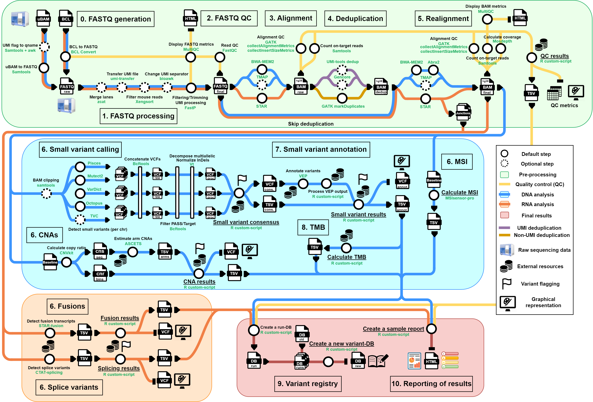

# ClinBioNGS


## 🧬 Pipeline Summary

**ClinBioNGS** is an open-source, panel-agnostic bioinformatics pipeline for the analysis of somatic NGS cancer panels using tumor-only DNA and RNA data. Designed for clinical and translational research, ClinBioNGS enables accurate, reproducible, and interpretable detection of a wide range of genomic alterations. Built with Nextflow and containerized environments, the pipeline ensures full portability, modularity, and flexibility across computing platforms.

ClinBioNGS integrates consensus small variant calling, panel-specific CNA and MSI reference models, automated annotation and prioritization modules, internal QC systems, and a variant database for longitudinal tracking. Final results are compiled into interactive, visual HTML reports, facilitating multidisciplinary interpretation. The pipeline has been validated on SEQC2 reference datasets and thousands of real-world clinical samples, showing performance comparable to commercial tools while offering greater transparency and extended biomarker support.



## 📂 Documentation

See the [docs/](docs) folder for full documentation:

- [Overview](docs/overview.md)
- [Installation](docs/installation.md)
  - [Software](docs/software.md)
  - [Resources](docs/resources.md)
- [Configuration](docs/configuration.md)
- [Input files](docs/input_files.md)

## 📦 Requirements

- Nextflow ≥ 24.10.1
- Apptainer ≥ 1.4.1
- Linux environment (HPC with SLURM/SGE or local)

## 🔧 Installation

Clone the repository:

```bash
nextflow clone raulmarinm/ClinBioNGS # or using git
cd ClinBioNGS
chmod +x bin/*
```

ClinBioNGS includes pre-analysis modules to automatically download and prepare all the containerized tools and resources required for each functional stage of the pipeline. This ensures reproducibility, minimizes manual intervention, and standardizes the analysis across environments.

Download Singularity images:

```bash
nextflow run main.nf --prepareImages --runName setup # Profiles (e.g., sge, slurm) can be included
```

Prepare pipeline resources:

```bash
nextflow run main.nf --resourcesOnly --runName setup

rm -r work # optional: delete intermediate files to save space (resources files and logs are copied to the ClinBioNGS folder)
```

Full lists of software tools and resources can be consulted in [Software](docs/software.md) and [Resources](docs/resources.md) sections.

## 🧪 Example Run

### TSO500 analysis on a SLURM cluster

```bash
nextflow run main.nf -profile slurm,tso500 \
  --runName TSO500_RUN \
  --projectDir /mnt/projects/ClinBioNGS/output \
  --dataDir /mnt/projects/ClinBioNGS/data \
  --startingDataDir /mnt/illumina_runs/TSO500_Run/BclDirectory
```

### Custom panel analysis on an SGE cluster

```bash
nextflow run main.nf -profile sge,custom \
  --runName customPanel_RUN \
  --projectDir /mnt/projects/ClinBioNGS/output \
  --dataDir /mnt/projects/ClinBioNGS/data \
  --startingDataDir /mnt/data/custom_samples \
  --sampleSheet ./resources/sampleSheets/SampleSheet_customPanel_RUN.csv
```

## 📄 License

Licensed for research and academic use only. Commercial use requires prior approval. See [LICENSE.md](LICENSE.md).

## 📣 Citation
